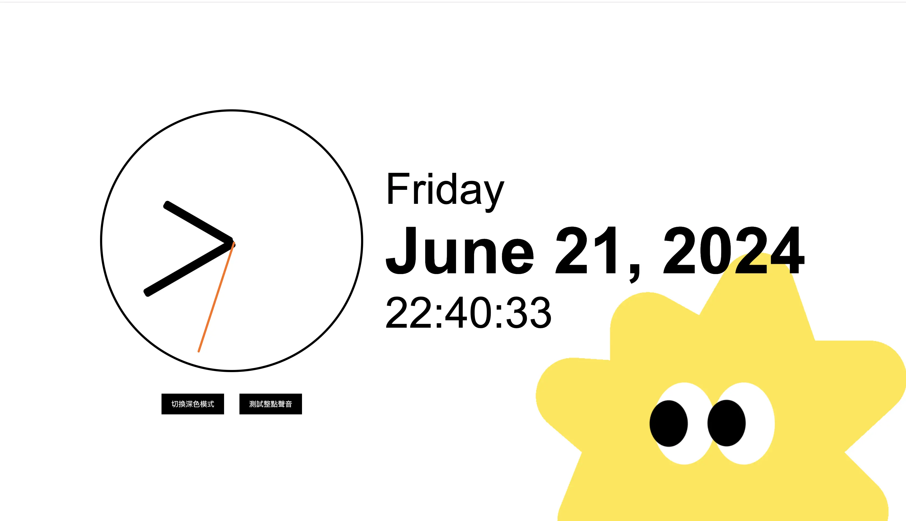

# 泰山職訓前端班時鐘作業
發揮創意美化你上課完成的時鐘，並試著加入更多功能  

## 注意
請盡量使用上課教的 GUI 工具或 git 指令繳交作業  
若使用 GitHub 網頁進行 commit 會依次數扣分

## 介紹
little star 時鐘會有一隻黃色小星星陪伴我們生活  
依照日常作息呈現活動、放鬆和睡眠的小星星動態圖像
並提醒使用者要好好生活、休息和照顧自己   
時鐘整點會報時播放音樂  
並且有深色和淺色模式介面可切換做選擇  
  

## Demo
[線上瀏覽](https://mushroomandhana.github.io/little_star_clock/index.html)
